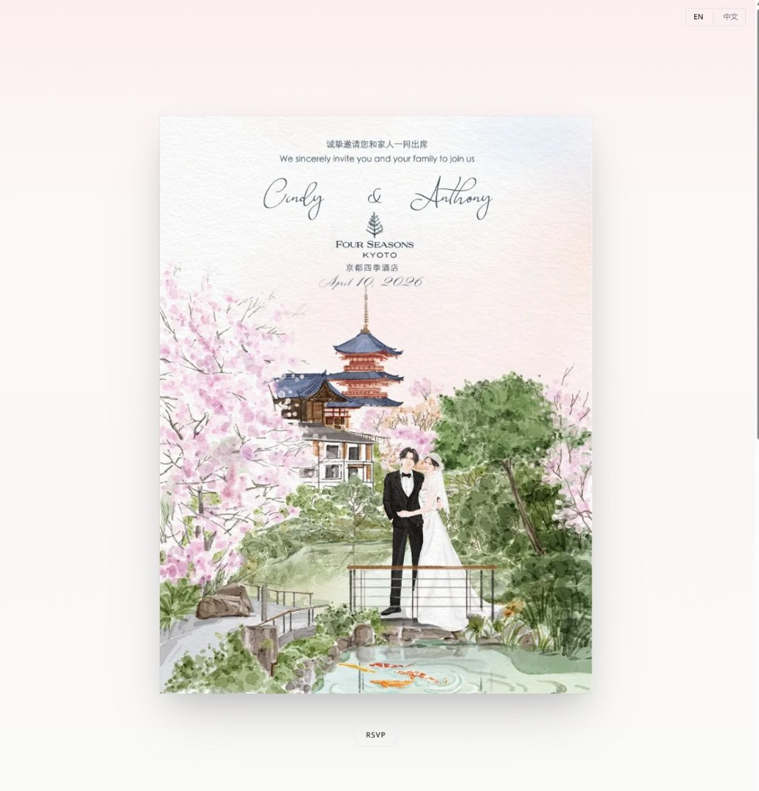

# Cindy & Anthony · Wedding

> A minimal, Japanese-inspired wedding invitation site — one link to share, RSVP and registry in one place.

[](https://nextjs.org/)
[](https://supabase.com)
[](https://stripe.com)

---

## Preview



**What you get:**

| Section | Description |
|--------|-------------|
| **Hero** | Full-screen invitation image (yours) with a soft sakura gradient; image shrinks on scroll. |
| **RSVP** | Single pill button on the photo; scrolls to a tabbed form (name, email, attending, guests). |
| **Registry** | Second tab: cash gift (Stripe) + optional gift registry link. |
| **Details** | Venue, address, date & time — clean block under the hero. |
| **Language** | EN / 中文 toggle (top right); all copy switches to Simplified Chinese. |
| **Admin** | `/admin` — password-protected list of RSVPs (names, counts). |

---

## Quick start

### 1. Run locally

```bash
npm install
cp .env.example .env   # add Supabase keys, ADMIN_PASSWORD (see plan.md)
npm run dev
```

Open **http://localhost:3000**. Admin: **http://localhost:3000/admin**.

<details>
<summary>Windows: if <code>npm</code> fails in PowerShell</summary>

- Use **Command Prompt** (cmd): `cd C:\Users\Admin\Documents\Wedding` then `npm run dev`, or  
- Double-click **`run-dev.cmd`** in this folder.
</details>

### 2. Database (Supabase)

1. Create a project at [supabase.com](https://supabase.com).
2. In **SQL Editor**, run the contents of **[`supabase/schema.sql`](supabase/schema.sql)**.
3. In **Project settings → API**, copy URL and keys into `.env` (see [`.env.example`](.env.example)).

### 3. Deploy (Vercel)

1. [Import this repo](https://vercel.com/new) on Vercel.
2. Add the same env vars as in `.env.example`.
3. Deploy and share the live URL as your invitation.

---

## Repo structure

| Path | Purpose |
|------|---------|
| `src/app/page.tsx` | Main page: hero, details, RSVP/Registry tabs |
| `src/app/admin/page.tsx` | Password-protected RSVP list |
| `src/app/api/rsvp/route.ts` | POST RSVP → Supabase |
| `supabase/schema.sql` | Table + RLS for `rsvps` |
| [**plan.md**](plan.md) | Full setup checklist, env vars, event details |

---

## Updating the preview

Replace **`docs/preview.png`** with a new screenshot and push — the README will show the new image.

---

*Cindy & Anthony · April 10, 2026 · Four Seasons Hotel Kyoto*
